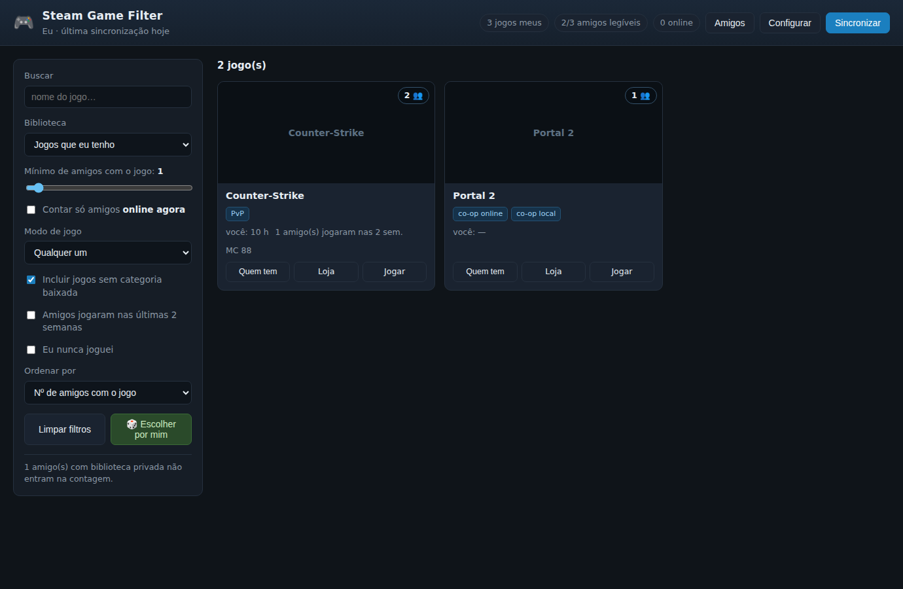

# Steam Game Filter

App local que sincroniza com a sua conta Steam e filtra a sua biblioteca **pela quantidade de amigos que
têm cada jogo** — inclusive só os que estão **online agora** — para você escolher o que jogar em segundos.



## Por que essa arquitetura (a resposta curta)

| Decisão | Por quê |
|---|---|
| **Web app rodando na sua máquina** (`http://127.0.0.1:8777`), não site hospedado nem app de celular | A Steam Web API **não permite chamada direta do navegador** (sem CORS) e a chave de API **não pode ir para o front-end** — precisa de um servidor. Um servidor local resolve isso sem hospedagem, sem custo e sem sua chave sair do seu PC. |
| **Chave da Web API + SteamID**, sem "login com Steam" | Para uso pessoal, OpenID só adicionaria um fluxo de autenticação sem dar nenhum dado a mais: tudo que o app lê (biblioteca, amigos, jogos dos amigos) vem da Web API com a sua chave. |
| **Cache em SQLite** (`data/steam.db`) | Ler a biblioteca de N amigos é 1 requisição por amigo. Sem cache, cada filtro custaria minutos; com cache, filtrar é instantâneo e você só sincroniza quando quiser. |
| **Python + FastAPI**, front-end em HTML/JS puro | Zero build step: `pip install` e roda. Você já usa Python 3.12 neste repositório. |
| Categorias (co-op/PvP) vindas da **API pública da loja**, com cache permanente | É a única fonte que diz se o jogo é multiplayer. Ela limita ~200 consultas a cada 5 min, então o app busca em fila, prioriza os jogos com mais amigos e **nunca rebusca** o que já tem. |

> **Primeira vez? Siga o [COMECE_AQUI.md](COMECE_AQUI.md)** — passo a passo, sem jargão.

## Requisitos

- Python 3.10 ou superior
- Uma chave da Steam Web API: <https://steamcommunity.com/dev/apikey> (grátis, pede só um domínio qualquer)
- No **seu** perfil Steam → *Editar perfil* → *Privacidade*: **Lista de amigos** e **Detalhes do jogo** em
  **Público**. A chave de API respeita a privacidade, mesmo sendo a sua conta.

## Instalação e uso

### Windows (jeito rápido)

```bat
run.bat
```

Cria o ambiente virtual, instala as dependências, sobe o app e abre o navegador.

### Qualquer sistema

```bash
python -m venv .venv
.venv/bin/pip install -r requirements.txt     # Windows: .venv\Scripts\pip
.venv/bin/python -m steam_filter               # sobe em http://127.0.0.1:8777
```

Na primeira execução, a tela de **Configurar** pede a chave da API e o seu SteamID64 (ou a URL do seu
perfil — o app resolve o vanity name). Depois é só clicar em **Sincronizar**.

Prefere não usar a tela? Copie `.env.example` para `.env` e preencha `STEAM_API_KEY` e `STEAM_ID`.

Sincronizar pelo terminal, sem abrir a interface:

```bash
.venv/bin/python -m steam_filter sync            # tudo
.venv/bin/python -m steam_filter sync --mode details   # só continua a fila de categorias da loja
```

## O que dá para filtrar

- **Nº de amigos que têm o jogo** (o filtro principal) e **nº de amigos online agora** que têm o jogo
- Biblioteca: só os meus jogos · meus + dos amigos · **só os que os amigos têm e eu não** (o que comprar)
- Modo de jogo: multiplayer, co-op, co-op online, co-op local/tela dividida, PvP, Remote Play Together
- Amigos que jogaram nas últimas 2 semanas (o que está "quente" no grupo)
- Jogos que eu nunca joguei · busca por nome
- Ordenação por amigos, amigos online, horas jogadas, última vez que joguei, Metacritic, nome
- **🎲 Escolher por mim** — sorteia entre os jogos que passaram no filtro, quando a decisão trava
- Clicar em **Quem tem** lista os amigos donos do jogo, quem está online e quantas horas cada um tem

Os filtros ficam salvos no navegador; **Jogar** abre o jogo direto pelo cliente Steam (`steam://run/<id>`).

## Como funciona a sincronização

1. `ISteamUser/ResolveVanityURL` + `GetPlayerSummaries` → confirma quem é você
2. `IPlayerService/GetOwnedGames` → sua biblioteca
3. `ISteamUser/GetFriendList` → seus amigos
4. `GetOwnedGames` para **cada** amigo (em paralelo, com controle de taxa) → é isto que gera a contagem
5. `store.steampowered.com/api/appdetails` → categorias (multiplayer/co-op/PvP), em fila e com cache

Tudo é gravado em `data/steam.db`. Sincronizar de novo atualiza; não duplica. Dá para cancelar no meio —
o que já veio fica salvo.

## Limitações (são da Steam, não do app)

- **Amigo com "Detalhes do jogo" privado não pode ser contado.** Não existe endpoint que contorne isso.
  A barra lateral e o painel **Amigos** mostram quantos amigos são legíveis, para você saber o tamanho do
  ponto cego.
- A API da loja limita ~200 consultas a cada 5 minutos. Por isso as categorias vêm aos poucos: os jogos
  ainda sem categoria aparecem marcados com `categoria ?` e continuam entrando nos filtros de modo de jogo
  (a menos que você desmarque *"Incluir jogos sem categoria baixada"*). Use **continuar detalhes** no
  rodapé dos filtros para seguir de onde parou.
- Amigos "online agora" é consultado ao vivo, com cache de 45 s. Se a Steam não responder, o app continua
  funcionando com os dados em cache — só não mostra o status online.

## Estrutura

```
steam-filter/
├── run.bat / run.ps1            atalho para Windows
├── requirements.txt
├── .env.example
├── steam_filter/
│   ├── __main__.py              CLI: serve | sync
│   ├── config.py                chave, SteamID e ajustes (env > .env > data/config.json)
│   ├── steam_api.py             cliente assíncrono: rate limit, retry, perfis privados
│   ├── db.py                    schema SQLite + classificação das categorias
│   ├── sync.py                  orquestração da sincronização, com progresso e cancelamento
│   ├── queries.py               as consultas que fazem a filtragem
│   ├── server.py                API HTTP (FastAPI)
│   └── web/                     interface (HTML/CSS/JS, sem build)
└── tests/test_smoke.py          teste ponta a ponta com a Steam falsificada
```

## Testes

```bash
.venv/bin/python tests/test_smoke.py
```

Sobe uma Steam falsa (`httpx.MockTransport`), roda a sincronização inteira e confere contagem de amigos,
cada filtro, o cache da loja, a detecção de perfil privado e todos os endpoints HTTP. Não toca a rede.

## Privacidade

A chave da API e o banco ficam só em `data/` (fora do Git, junto com `.env` e `.venv`). Nada é enviado
para lugar nenhum além da própria Steam.
